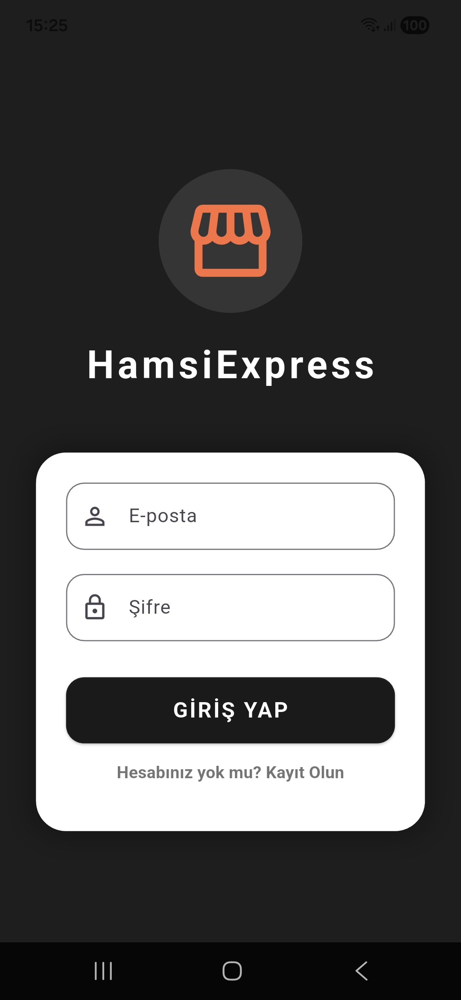
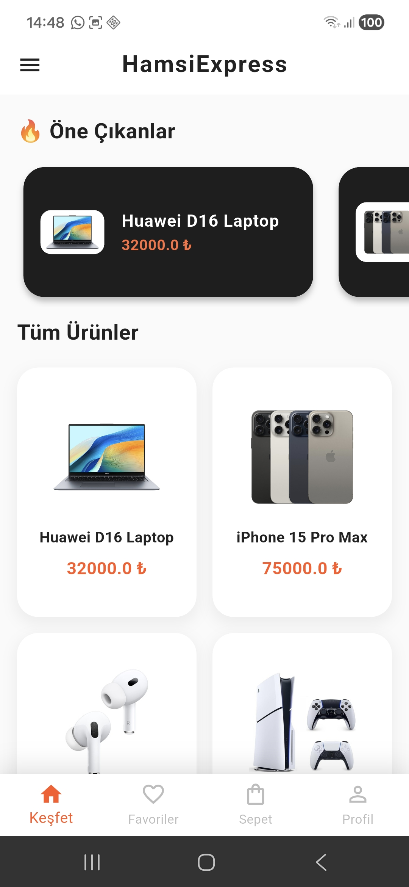
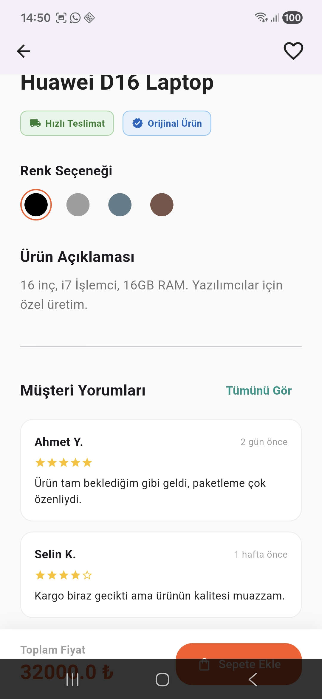
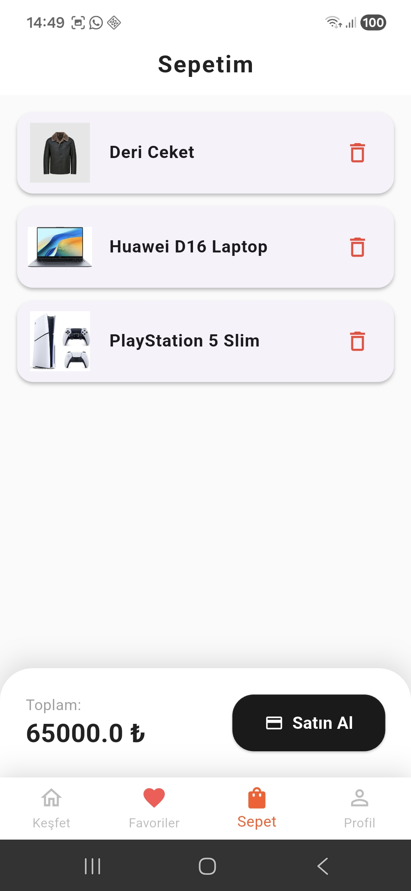
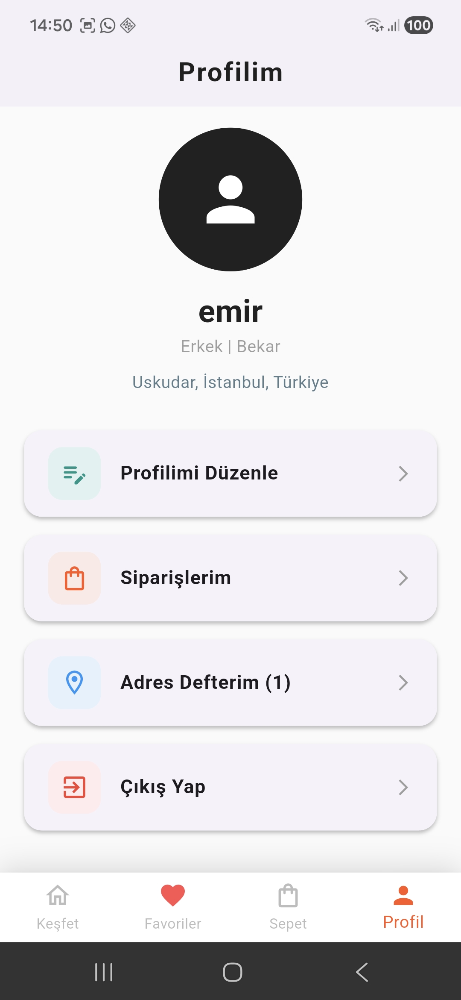

# 📱 HamsiExpress Store - Mini Katalog Uygulaması


Bu proje, mobil uygulama geliştirme süreçlerini uçtan uca öğrenmek ve modern UI/UX standartlarını uygulamak amacıyla geliştirilmiş bir **Eğitim / Staj Projesi**dir. Kapsamlı bir e-ticaret (katalog) uygulamasının temel dinamiklerini barındırır.

## 🚀 Projenin Amacı
"Mini Katalog" konseptiyle tasarlanan bu uygulama, kullanıcıların ürünleri listeleyebildiği, detaylarını inceleyebildiği, sepet ve favori işlemlerini yönetebildiği dinamik bir yapı sunar. Proje kapsamında mobil programlama mimarisi, sayfa yönlendirmeleri ve veri yönetimi standartlara uygun olarak inşa edilmiştir.
## 📸 Ekran Görüntüleri

Projenin tüm arayüz tasarımlarına ve ekran görüntülerine depodaki [screenshots/](screenshots/) klasöründen ulaşabilirsiniz. Aşağıda uygulamanın temel akışını gösteren 3 ana ekran bulunmaktadır:

<br>

<p align="center">
  
  &nbsp;&nbsp;&nbsp;&nbsp;
  
  &nbsp;&nbsp;&nbsp;&nbsp;
  
  &nbsp;&nbsp;&nbsp;&nbsp;
  
   &nbsp;&nbsp;&nbsp;&nbsp;
  
</p>
</p>

## 🌟 Temel Özellikler
* **Katalog Tasarımı:** `GridView` kullanılarak tasarlanmış şık ve duyarlı (responsive) ürün kartları.
* **Detaylı İnceleme:** `Hero` animasyonları ile desteklenmiş, renk seçenekleri ve değerlendirmelerin bulunduğu dinamik ürün detay sayfası.
* **Sepet ve Ödeme Sistemi:** Sepete ürün ekleme, sepet tutarını otomatik hesaplama ve ödeme onayı simülasyonu.
* **Favoriler:** Kullanıcıların beğendikleri ürünleri global state üzerinden tek tıkla kaydetmesi.
* **Kişiselleştirilmiş Profil:** Çoklu adres ekleme yeteneği sunan "Adres Defteri" mimarisi ve profil güncelleme modülü.
* **Sipariş Geçmişi:** `ExpansionTile` kullanılarak hazırlanan, açılır-kapanır detaylı sipariş kartları.

## 🛠️ Kullanılan Teknolojiler ve Mimari
Hocalar ve danışmanlar tarafından beklenen temel mimari gereksinimler projeye başarıyla entegre edilmiştir:

* **Framework:** Flutter (Sürüm: 3.41.0 - Stable Channel)
* **Dil:** Dart (Sürüm: 3.11.0)
* **Navigasyon (Routing):** Sayfalar arası geçişlerde spagetti koddan kaçınılarak **Named Routes** (`Navigator.pushNamed`) kullanılmış; sayfalar arası veri aktarımı ise profesyonel standart olan **Route Arguments** ile sağlanmıştır.
* **Asset Yönetimi:** Ürün verileri kodların içine gömülmek yerine, `assets/data/urunler.json` dosyasından asenkron (Future/async) olarak parse edilerek çekilmiştir. Görseller lokal `assets/images/` klasöründen yönetilmektedir.
* **Durum Yönetimi (State Management):** Sayfa içi anlık güncellemeler için `StatefulWidget` ve `setState` kullanılmış, proje geneli (sepet, favoriler, adresler) global veri modelleri üzerinden haberleştirilmiştir.

## 💻 Kurulum ve Çalıştırma

Projeyi kendi ortamınızda derlemek için aşağıdaki adımları izleyebilirsiniz:

1. Depoyu bilgisayarınıza klonlayın:
   ```bash
   git clone [https://github.com/Emirhan-RZ/Mini-Katalog-mobil-uygulamas-.git](https://github.com/Emirhan-RZ/Mini-Katalog-mobil-uygulamas-.git)
